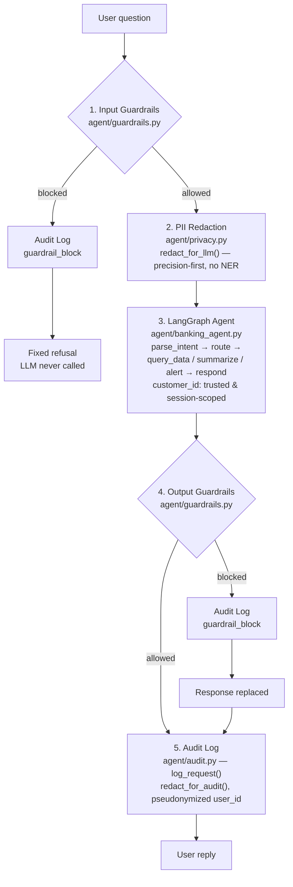
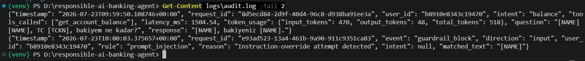
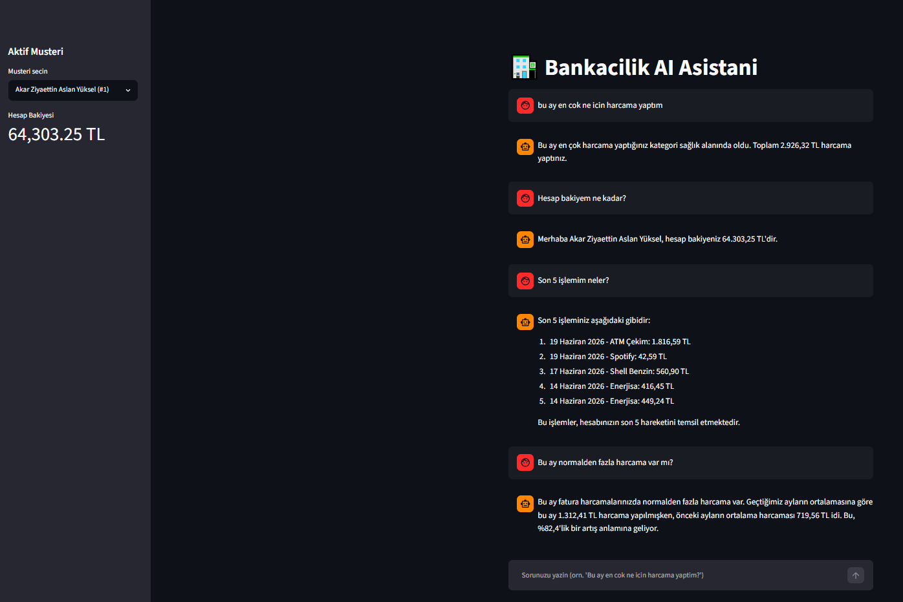

# Responsible AI Banking Agent

**Live demo (baseline agent — before the governance layer):** huggingface.co/spaces/Mervecaliskan/banking-ai-agent
**Türkçe:** [README.tr.md](README.tr.md)

> The deployed Space predates this repo's PII redaction, guardrails, and audit logging, so it behaves differently:
> it accepts an identity typed into the chat, while the current version ignores that and uses the trusted,
> session-scoped `customer_id` instead.

A conversational banking assistant — and the governance layer that makes it deployable in a regulated environment.

---

## Why this repo exists

**The starting point** was a working [LangGraph](https://www.langchain.com/langgraph) banking agent: an
intent-routed assistant, powered by `llama-3.3-70b-versatile` on [Groq](https://groq.com/), that answers natural-
language questions ("what's my balance?", "what did I spend the most on this month?") against synthetic account and
transaction data.

**The problem:** it worked, but it wasn't deployable anywhere a bank would actually put it. There was no PII
protection — a user's TC Kimlik No, IBAN, or phone number typed into the chat went straight to the LLM and straight
into the logs. There were no guardrails — nothing stopped a prompt-injection attempt, a request for another
customer's data, or the agent drifting into investment advice. There was no audit trail — no record of what the
agent decided or why. And there was no documentation of any of this for a reviewer to check.

**What this repo adds** is the governance layer that closes those gaps: PII redaction, input/output guardrails, and
structured audit logging, sitting around the original agent without changing its core logic — plus the tests and
documentation to back it up. That's the story this README tells.

---

## Architecture: where governance sits in the request flow



Two things worth noticing in this diagram:

- **Redaction is asymmetric on purpose.** Text heading to the LLM is redacted with a precision-first policy (no
  NER) — a false-positive redaction there could corrupt words the intent classifier depends on. Text heading to the
  audit log uses a recall-first policy (adds spaCy NER) — a false positive in a log is harmless, a missed one is a
  compliance failure.
- **A blocked input never reaches the LLM at all.** Guardrails run before the first model call, not after, so
  prompt-injection attempts cost nothing beyond a regex check.

Full rationale, including known gaps, is in the [model card](docs/MODEL_CARD.md).

---

## Governance layer

| Component | What it does | Code |
|---|---|---|
| **PII redaction** | Microsoft Presidio, with checksum-validated custom recognizers for Turkish TC Kimlik No (official checksum) and IBAN (ISO 7064 MOD97), plus a stoplist-filtered Turkish name heuristic. Two policies — precision-first for the LLM path, recall-first for the audit path. | [`agent/privacy.py`](agent/privacy.py) |
| **Guardrails** | Input: prompt injection, prompt/system extraction, customer_id manipulation, SQL-injection-shaped input. Output: financial/investment advice, cross-customer leakage, raw PII that survived redaction. Every block is a structured, logged decision. | [`agent/guardrails.py`](agent/guardrails.py) |
| **Audit logging** | One JSON line per request and per guardrail block: intent, tools called, latency, token usage, redacted question/response. `user_id` is pseudonymized (salted hash), never stored raw. | [`agent/audit.py`](agent/audit.py) |
| **Model card** | System overview, intended/out-of-scope use, evaluation results, and known limitations, written for a reviewer who wasn't in the room when this was built. | [`docs/MODEL_CARD.md`](docs/MODEL_CARD.md) |

---

## Results

Measured by the automated test suite ([`tests/`](tests/)):

| Check | Result |
|---|---|
| Adversarial prompts blocked | **25/25 (100%)** — prompt injection, prompt/system extraction, customer_id manipulation, SQL injection, financial advice, cross-customer leakage, raw PII leakage |
| Benign prompts allowed | **7/7 (0% false positives)** |
| Automated tests passing | **50/50** (32 for PII redaction, 18 for guardrails) |
| TCKN / IBAN detection | Real checksum algorithms (official Turkish ID checksum, ISO 7064 MOD97-10) — not shape-matching |

These numbers are a regression check on a curated adversarial set, not a security certification — see
[Known Limitations](docs/MODEL_CARD.md#known-limitations) in the model card for what this doesn't cover (novel
phrasing, encoding tricks, multi-turn attacks, independent red-teaming).

---

## Evidence



Two real lines from `logs/audit.log`, produced by actually running the agent:

- **Normal request** (top line) — a question containing a name and a TC Kimlik No is logged with both redacted
  (`[NAME]`, `[TCKN]`) before it ever touches disk.
- **Blocked request** (bottom line) — a prompt-injection attempt trips the `prompt_injection` rule and is logged as
  a `guardrail_block` event. Two things to notice: `intent` is `null`, because the block happens on input, before
  the LLM is ever called — there's nothing to classify. And `matched_text` — the very evidence of what tripped the
  rule — is itself redacted (`[NAME]`), because a security log is an attack surface too; it can't be allowed to
  leak the PII it exists to catch.

---

## System overview

The agent classifies a question's intent (`balance` / `transactions` / `spending` / `anomaly` / `general`), routes
to a matching tool, and turns the result into a natural-language reply:

| Question | Routes to |
|---|---|
| "What's my account balance?" | `query_data` (balance) |
| "What are my last 5 transactions?" | `query_data` (transactions) |
| "What did I spend the most on this month?" | `summarize` (spending) |
| "Is there more spending than usual this month?" | `alert` (anomaly) |

All data is synthetic — [`data/generate_data.py`](data/generate_data.py) generates 10 customers and ~550
transactions via `Faker('tr_TR')`, including a deliberately injected spending anomaly so the anomaly-detection path
has something real to catch. No real banking infrastructure or customer data is used anywhere in this system.



---

## Project Structure

```
responsible-ai-banking-agent/
├── assets/
│   └── demo_screenshot.png  # Demo screenshot
├── data/
│   └── generate_data.py     # Synthetic customer/transaction generator
├── tools/
│   └── query_tools.py       # LangChain tools (SQLite + pandas)
├── agent/
│   ├── banking_agent.py     # LangGraph state machine
│   ├── audit.py             # Structured audit logging
│   ├── privacy.py           # PII detection & redaction (Presidio)
│   └── guardrails.py        # Input/output guardrails
├── tests/
│   ├── test_privacy.py      # 32 tests
│   └── test_guardrails.py   # 18 tests
├── docs/
│   └── MODEL_CARD.md        # System card: scope, evaluation, limitations
├── app.py                   # Streamlit chat interface
├── requirements.txt
└── .env.example
```

---

## Setup and Running

```bash
# 1. Virtual environment
python -m venv venv
source venv/Scripts/activate   # Windows: venv\Scripts\activate

# 2. Dependencies
pip install -r requirements.txt

# 3. Add your GROQ_API_KEY to the .env file
cp .env.example .env
# in .env: GROQ_API_KEY=sk-...

# 4. Generate synthetic data
python data/generate_data.py

# 5. Start the app
streamlit run app.py

# Run the test suite
python -m pytest tests/ -v
```

---

## Tech Stack

- **LangGraph** — intent-based conditional routing state machine
- **LangChain** — tool definitions
- **Groq (Llama-3.3-70b-versatile)** — intent classification and natural-language response generation
- **Microsoft Presidio + spaCy** — PII detection and redaction
- **SQLite + pandas** — synthetic data storage and querying
- **Streamlit** — chat interface
- **Faker** — synthetic Turkish data generation
- **pytest** — 50 automated tests

## Documentation

- [Model Card](docs/MODEL_CARD.md) — scope, evaluation results, known limitations, risks and mitigations
- [README.tr.md](README.tr.md) — Turkish version
